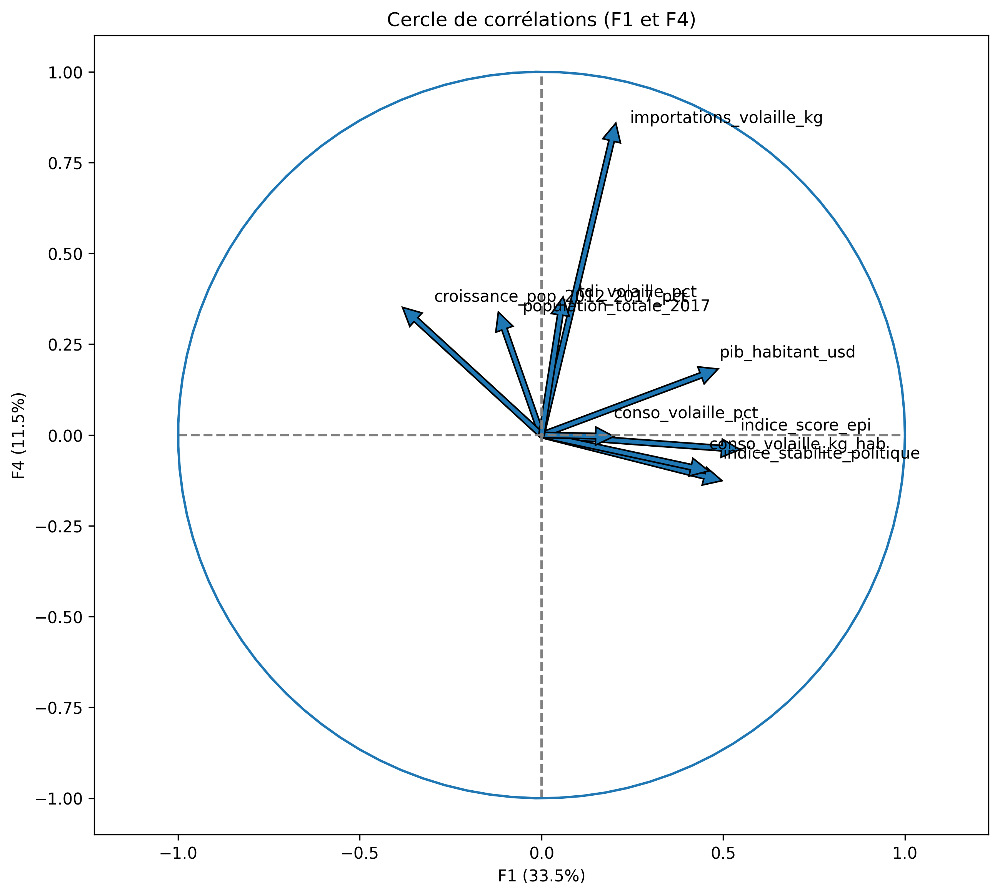
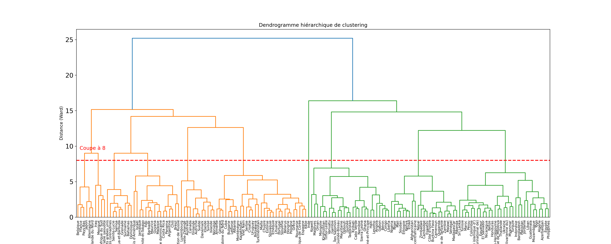
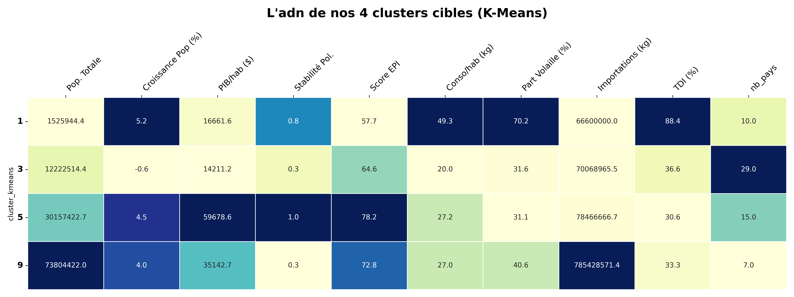

# Stratégie d'exportation internationale

Machine learning non supervisé pour identifier les marchés d'exportation optimaux d'une marque agroalimentaire. Utilisation de la PCA pour la réduction de dimensionnalité et de K-Means pour la segmentation.

**Stack :**  | `Python 3.x`, `Scikit-Learn`, `Pandas`, `uv`|

## Vue d'ensemble
Analyse segmentant plus de 150 pays selon des critères macro-économiques et démographiques afin d'identifier les marchés à fort potentiel pour un lancement de nouveaux marchés.

Résultats :
- 237 pays réduits à 6 clusters de marché (PCA capturant 87% de la variance).
- Profilage quantifié des clusters (PIB par habitant, densité, maturité réglementaire).
- 5 marchés d'entrée recommandés offrant un équilibre risque/récompense optimal avec une priorité sur 2 pays.

## Livrables
- `01_preparation_donnees.ipynb` : Préparation et agrégation des données
- `02_acp_et_clustering` : Analyse complète et reproductible.
- `03_presentation_recommandations.pdf` : Synthèse stratégique et profils de clusters.

<table>
  <tr>
    <td align="center"> <b>Cercle corrélation</b></td>
    <td align="center"> <b>Projection Pays</b></td>
    <td align="center"> <b>Matrice Centroides</b></td>
  </tr>
</table>

## Licence & Authorship

Projet réalisé dans le cadre de la certification **Data Analyst / Analytics Engineer - OpenClassrooms P11**
Juillet 2026 · Sébastien Guitton