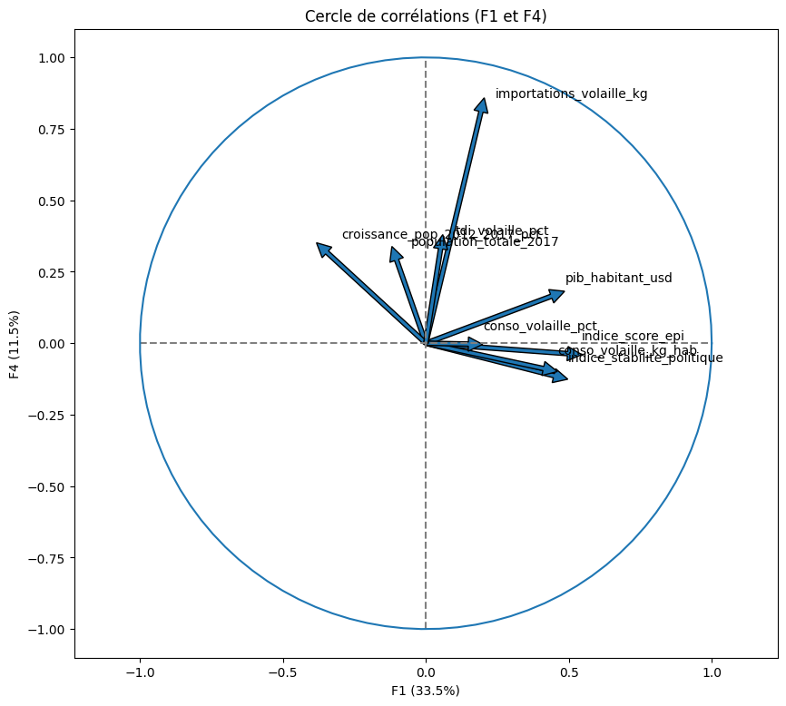
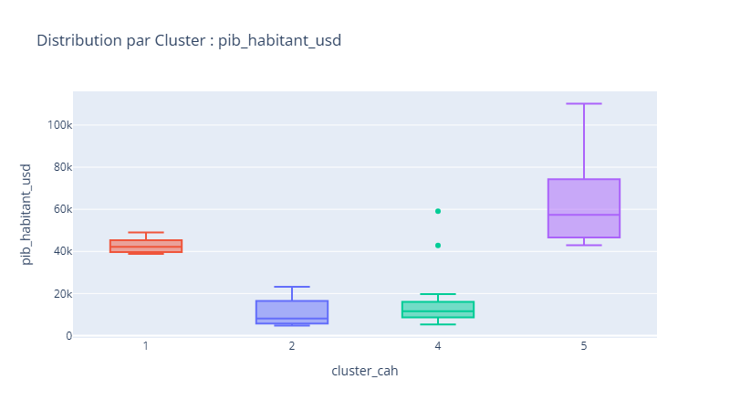
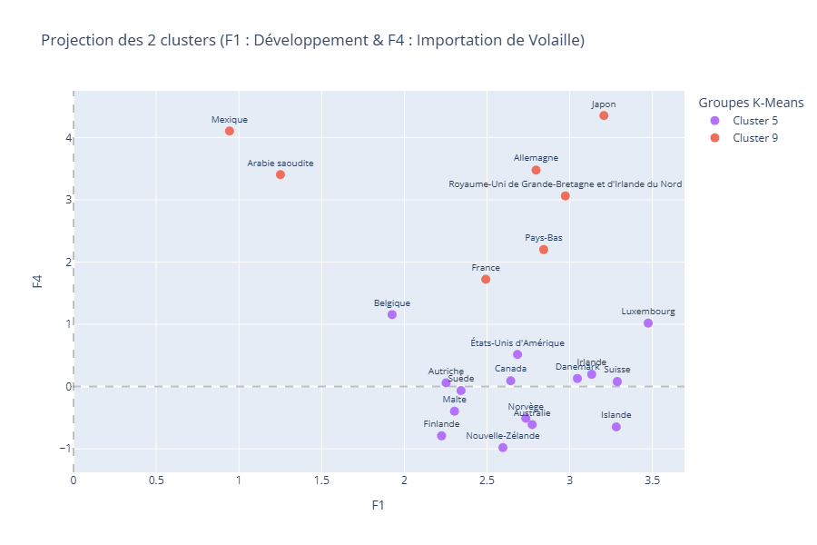

# Stratégie d'exportation internationale

Machine learning non supervisé pour identifier les marchés d'exportation optimaux d'une marque agroalimentaire. Utilisation de la PCA pour la réduction de dimensionnalité et de K-Means pour la segmentation.

**Stack :**  | `Python 3.x`, `Scikit-Learn`, `Pandas`, `uv`|

## Vue d'ensemble
Analyse segmentant 160 pays selon 9 critères macro-économiques, d'importation et de stabilité géopolitique, afin d'identifier les marchés à fort potentiel pour un lancement de nouveaux marchés.

## Résultats :
- Synthèse de l'information mondiale via une ACP (5 composantes capturant >80% de la variance).

- Classification de 160 pays en 10 clusters de marché via CAH et K-Means.

- Identification des clusters par pouvoir d'achat (PIB/hab), volume d'importation, dépendance extérieure et score environnemental (EPI).

- 5 marchés d'entrée recommandés offrant un équilibre risque logistique / opportunité commercial optimal avec une priorité sur 2 pays (Allemagne et Belgique).

## Livrables
- `01_preparation_donnees.ipynb` : Préparation et agrégation des données
- `02_acp_et_clustering` : Analyse complète et reproductible.
- `03_presentation_recommandations.pdf` : Synthèse stratégique et profils de clusters.

<table>
  <tr>
    <td align="center"> <b>Cercle corrélation</b></td>
    <td align="center"> <b>Distribution Cluster PIB/hab</b></td>
    <td align="center"> <b>Projection de 2 clusters</b></td>
  </tr>
</table>

## Licence & Authorship

Projet réalisé dans le cadre de la certification **Data Analyst / Analytics Engineer - OpenClassrooms P11**
Juillet 2026 · Sébastien Guitton
